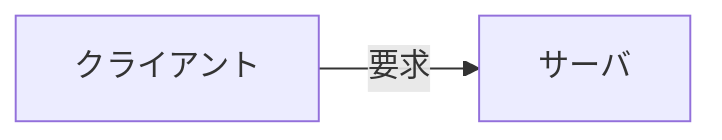
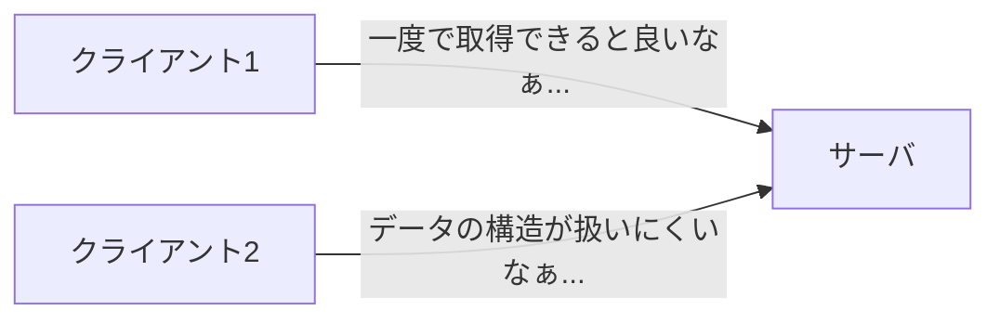
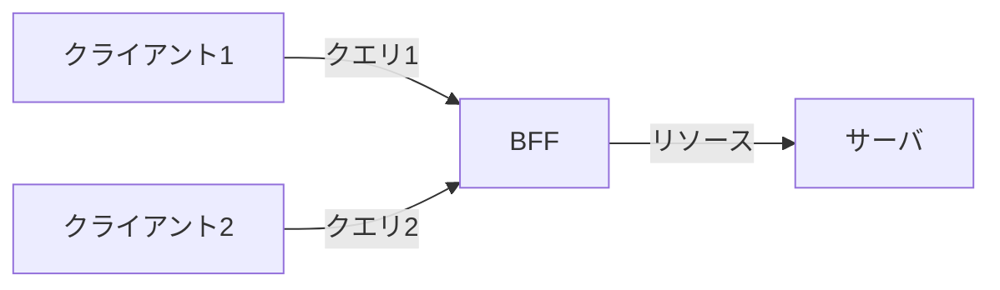
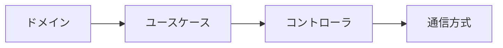

# はじめに

`GraphQL`は非常に高機能なツールである一方、万能が故に本来必要でないケースでも気軽に利用されている印象を受けます。
筆者は同じ組織で同じ目的のために構築されたサーバとクライアントの通信において、`GraphQL`を採用すべきでないと考えており、本記事ではそのポイントを整理していきます。
なお、本記事ではこのような1対1型のシステムを`サーバクライアント型`とよびます。

念のために記載しますが、`GraphQL`は素晴らしい技術であり、本記事は`GraphQL`を批判するものではありません。

# TL;DR

- (本当の意味で) `Code First`な開発を進めることが難しい
- `サーバクライアント型`のシステムでは概念的に両者は一体であるため、両者間の結合を抽象化しない方がよい
- ドメイン駆動設計を実践するに当たって、ドメインから視点をブラし、モデル駆動開発を阻害する要因となる

# 開発チームの想定

本記事での検討は以下のような開発チームを想定しています。

- toB向けの業務システムの開発するチーム
- 開発プロセスにスクラムを採用している

# 価値観

技術的なプラクティスは、その前提となる`価値観`によって選定されるため、
検討に先立って、まずは前提となる`価値観`を整理していきたいと思います。

まず一番大切なこととして、そもそもエンジニアリングの`目的`はなんでしょうか？

筆者の考えとしては、シンプルに**ユーザへ価値を提供をすること**です。
エンジニアが業務としてシステム開発を行う場合、所属組織の事業推進の一助を担っているため、ユーザ価値の最大化へ貢献していくことが求められます。
そして、技術はそのための`手段`であり、`手段`と`目的`は逆転させるべきではありません。

概ねこういった`価値観`は実際に多くの開発エンジニアと合意しやすい内容だと感じています。

一方で、(筆者を含め)多くのエンジニアは技術的な詳細に対して、より強く興味や魅力を感じて意識を集中させてしまいやすい傾向があります。

では、どのようにすれば、日々の開発業務を`目的`と紐付けていくことができるでしょうか？

`ドメイン駆動設計(以下DDD)`はこの難しい課題に対しての答えとなるひとつの言語化された体型として、実際多くの組織に受け入れられています。

`DDD`では、上記のような視点の変化を与えてくれます。第一に技術的な詳細ではなく`ドメイン`に着目します。
ドメインを分析し、顧客に提供する機能とその実現方法をモデル化することで、ドメインモデルを構築します。
ドメインモデルはのほかのすべてのレイヤーから隔離されており、ドメインモデルの検討時には技術的な詳細を切り離して考えることができます。こうして構築されたモデルを利用して、モデル駆動でシステムの構築を進めます。

`DDD`を念頭に、筆者の価値観としては `技術的な課題 < ドメインの課題` という順番が前提になっており、開発エンジニアの思考やシステムの設計・開発に関しても、**同じ順番・重要度**で検討するべきだと考えています。

# GraphQLが必要になる状況

`GraphQL`に関する詳細な情報はほかの多くの情報源に譲るとして、
ここで議論したいポイントとしては、`GraphQL`が`BFF`として機能する点です。

従来の`クライアントサーバアーキテクチャ`では、クライアントとサーバが1対1で対応していました。

しかし、異なる目的のクライアントが同じサーバを利用するようになると、サーバ側がそれぞれのクライアントのニーズに合わせきれなくなってきます。

このような場合は、`BFF`を構築するメリットがあります。
サーバは**リソースを抽象化**(`GraphQL Schema`で定義)して配信し、クライアント側はそれぞれ**ニーズに合わせてクエリ**することができます。

このように、`GraphQL`は異なるニーズをもった複数のクライアントが存在する場合にメリットを発揮しますので、`GraphQL`の利用を検討する場合は、システムの全体構成を考慮しておくことが重要です。

例えば、あなたがGithubで働くエンジニアでありAPI開発している場合は、無数のクライアントが多岐にわたるニーズでAPIをコールすることが予想されるので、`GraphQL`の利用は魅力的な選択肢になります。

一方で、`GraphQL`のように抽象化して柔軟性を実現する技術には、本来的に高機能であり、その分の複雑性を秘めているので、必要のない状況で利用するといわゆるオーバーエンジニアリングな状態になります。

本記事では、このような`サーバクライアント型`のシステムに`GraphQL`を採用する是非に関して検討していきます。

# Code First で APIを構築する

`Code First`とは、コードからAPIのスキーマ(`IDL`)を生成する方式です。 
(`IDL`とは`GraphQL`, `OpenAPI`, `Protocol Buffers`などです)

これは直接的には`GraphQL`と関係ありませんが、`Code First`で開発を進めることによって、スムーズに`DDD`を実践してくことができると考えています。

`価値観`の章で述べたように、`DDD`をよく実践してくためには、エンジニアは最初にドメインからの視点で物事を考えてから、次第に技術的な詳細に思考を移していくのが基本的な流れになります。

今回のテーマで考えると以下のような順番です。

`ドメイン`には重要なドメイン知識がカプセル化され、`ユースケース`が一連の作業をまとめ上げてユーザの操作と合わせます。`コントローラ`は外部から`ユースケース`を呼び出すための単なる薄い変換層として実装されます。

一方で、`GraphQL`(OpenAPIでも同様)の通常の利用方法として、スキーマから書き始めると、この順番が逆転して、`通信方式`に近いレイヤーから考えていくことになります。

本来`コントローラ`は`ドメインオブジェクト`を使って表現されたデータを通信可能な方式(JSONなど)へ変換する役目を持っており、その構造のモデルは`DTO`などとして`コントローラ`に定義されます。そのため、`IDL`の定義(`GraphQL Schema`など)はわざわざ別途で記述する意義が薄く、本来は`DTO`から導出(自動生成)することができます。

このように、ドメインからの視点で開発を進める場合にAPIスキーマを考えること自体が単純なオーバーヘッドにもなりますが、保守性に影響を与えたり、もっと重大な副作用としては本来と逆の視点が要求されることでドメインから視点をブレらしてしまうことがあげられます。

# Code Firstに対する誤解

一口に`Code First`といっても、大きく分類して以下の2つがあると考えています。

1. CodeからSchemaを生成するもの
2. CodeでSchemaを書くもの

本記事ではオススメしたいのは、`1`の本来的な意味での`Code First`を指します。`2`の場合は利用しているツールが`TypeScript`などの汎用言語になっただけで、`Schema First`で開発している場合と本質的やっていることは変わらないからです。

しかしながら、`Nexus`, `Pothos`, `tRPC` などの有名はOSSは`2`の方式であることが多いです。そのため、`Schema First`と比較して**大きなメリットが得られずに疲弊するケースが多い**ように感じています。

筆者としては、`OpenAPI`を`Code First`で開発するツールとして [tsoa](https://tsoa-community.github.io/docs/getting-started.html)を利用することが多いです。`NestJS`などでも`Code First`な開発を進めることができますが、`tsoa`の方がより少ない注釈(デコレータ)で自然に`Code First`な開発を進めることができます。

参考: [Code Firstで疲弊しないOpenAPI活用方法](https://qiita.com/hedrall/items/ecc2010d8bc458a7b95e)

ちなみにあくまで筆者の推測ですが、`GraphQL`の方が`1`の`Code First`ツールを開発しにくいと考えています。`OpenAPI`の場合は通信に載せる`Payload`が基本的に`JSON`なので、バックエンドが`Node.js`で書かれていれば、`DTO`をほぼ機械的にJSON変換することができます。一方、`GraphQL`の`Query`や`Type`などは独自の概念であるため、異なる概念間でのマッピングはどうしても必要になるものと思われます。

# GraphQLはリソースを抽象化する

`GraphQL`と`OpenAPI`を比較する場合には大きなパラダイムの違いがあることを認識しておく必要があります。それは、**何で抽象化するか？** の違いです。

`GraphQL`や`REST API`はリソースを抽象化する手法です。`GraphQL Schema`上ではリソースを`type`として整理して、`query`によってアクセス方法を定義します。

一方で、`OpenAPI`を利用するシステムでは、純粋な`RESTful API`であるものは極稀で、一般的には`RPC(関数)`として抽象化します。

この辺りは以前記事にもまとめました。
[GraphQLとOpenAPIを比較する時は「REST API」に注意する](https://qiita.com/hedrall/items/a1a486993ff000eb6809)

つまり、`OpenAPI`を利用する場合、`サーバ`は`クライアント`のニーズに直接的に答えるような関数を整理することでHttp通信の内容を隠蔽しますが、`サーバ`側の`インターフェイス`は抽象化されずそのまま公開されるので、概念レベルでのサーバ・クライアント間の**結合度は強く**なります。 
一方で、`GraphQL`の場合は`サーバ`は`リソース`を抽象化して配信し、`クライアント`は自身のニーズに合わせて`Query Document`を組み立てることができるので、概念レベルでの両者の**結合度は低く**なります。

# 不要な抽象化層がスクラムチーム分断する

前章では、`GraphQL`を利用した方がよりサーバ-クライアント間の関係性が`抽象化`されることを説明しました。`抽象化`は技術的な詳細を切り離して疎結合化させるのに有効な手法です。

ここで明確しておきたいのが、`サーバクライアント型`のシステムにおいて、**バックエンドは技術的な詳細ではない**ということです。
ホストされる環境が違ったり、記述されている言語が違ったりという技術的な差異はあり得ますが、概念的には両者は同じニーズのために開発された一体のシステムです。

もう一つ前提としておきたいのは、`スクラムガイド`にある通りスクラムチームは**フルスタック**であることです。一つのチームが顧客への価値提供の全てをフルスタックに担っていきます。その人数はよく**ピザ2枚数ルール**と言われるように、8名前後とされており、そのうちエンジニアは4名前後でしょうか。
そのような環境では、それぞれのエンジニア個人においても、技術領域を限定せずに変幻自在な貢献が求められます。

そのため、`クライアント`から見て`サーバ`は抽象化して隠蔽するべき技術的な詳細ではなく、むしろ結合を明示的に管理し、**システム全体として概念的な凝集を構成する**ことが保守性を高めることにつながると考えます。

DevSecOpsなどの考え方からも、モダンな組織では職能型サイロを生むような構造はなるべく避けておきたいところです。

# Clean Architectureに対応させて考える

前節で検討した内容を、`Clean Architecture`の代表的な図を元にイメージしてみます。
少し雑ですが、下図のようにシステムのコンポーネントを円の上に置いてみます。

物理的に考えると`クライアント`と`サーバ`はそれぞれの円を構成し、円と円の間は青い層(Webの領域)が隔てています。

しかしながら、概念的には両者は同じシステムの一部であり、`ドメイン`を共有しているはずですし、`ユースケース`は`web`により分断されなければ本来は一体となっていたはずです。 そのため、システム全体の概念としては青い矢印で接続されて**1つの円を構成**します。

そして、このような構成を実現したい場合、**Web通信の技術的な詳細は隠蔽しつつ、バックエンドを隠蔽しないようなアーキテクチャ**が求められます。両者の概念的な結合は意味を持っており、`ユースケース`を分断するような`BFF層`はシステムのセマンティクスを破壊する可能性があります。

# Simple と Easy

技術選定をする際には、`Simple`と`Easy`の違いを意識することが重要だと考えています。

それぞれの説明として、著名なt_wadaさんの[ツイート](https://twitter.com/t_wada/status/1377147203077111814)を引用させていただくと、以下のように整理されています。

> Easy: 手数の少なさを重視（そのかわり覚えることが増え、特定の状況には強いが他には弱い設計になる） 
> Simple: 覚えることの少なさを重視（そのかわり手数が増えたり、自分で組み合わせたりしなければならない）

例えば`フレームワーク`と`ライブラリ`を比較した場合、`フレームワーク`は`Easy`にあたって、手数を少なく目的を実現させることができますが、内部は高度に複雑で**システムとの結合度は高く**なります。
一方で、`ライブラリ`は`Simple`にあたり、概念的により単純で自由度が高く、**システムとの結合度を低く**保つことが可能ですが、目的の達成までの手数が増えます。

一般論としては、安易に`Easy`に依存することはシステムの柔軟性を低下させるので、できるだけ`Simple`に保ちつつも、開発生産性とのトレードオフを考えるながら用法要量を守って`Easy`を適用していくのが賢い戦略です。

筆者としては、この`Simple`と`Easy`の対比が、`OpenAPI`と`GraphQL`の対比に当てはまると考えています。
`GraphQL`は`OpenAPI`と比べてより`フレームワーク`的な性質を持っており、システムとの結合度が高くなります。

`OpenAPI`を使って`NodeJS`でサーバを構築することを考えた場合、`express`のようなごくシンプルな`フレームワーク`からより高機能なものまで幅広に選定することができます。また、利用方法も一般的なWebの知識があれば、すぐに理解することができます。`tsoa`を利用した場合はサーバ側のボイラープレートを自動生成することができますが、`express`内部以外のコアなコードは数百行ほどで済みます。

一方、`GraphQL`は本来的に高機能であり、利用する場合には遥かに巨大な`Middleware`に依存する必要があります。 
`AWS`の場合、`AppSync`を構築・運用するだけでも多くのノウハウが要求されます。それに付随して、テスト環境・テストデータの用意、デバッグ方法、通信のモックなども、それぞれ独自のプラクティスを学ぶ必要があります。
フロントエンドは`GraphQL Schema`に対して`Query Document`を別途定義する必要がありますが、`fragment colocation` ( [参考](https://zenn.dev/so_nishimura/articles/2c8796761f2d02) )などをする場合は、`IDL`がコンポーネントレベルまで結合します。
こうなると、本来はフロントエンドにとってもドメインが重要ですが、`GraphQL Schema`との結合が強くなることで意識の外に追いやられてしまう危険性があります。

フレームワークを利用する際は、注意して取り組まないとフレームワーク由来の構造が顕現しやすく、本質的なレイヤーが失われます。
また、巨大な複雑性に依存することで思わぬ対応工数や学習コスト・認知不可の増大をもたらすこともあります。

フレームワークは一見すると`銀の弾丸`に見えることがありますが、このようなトレードオフを受け入れるだけのメリットが得られるか？現時点のプロダクト戦略と一致するか？を慎重に検討する必要があります。

`DDD`では`モデル駆動`を妨げるようなアーキテクチャ上の制約が発生しないように注意する必要があります。

# 終わりに

長文にもなって、多分に読みにくさのある記事になってしまったと思いますが、以上のような理由から筆者としてクライアントサーバ型のシステムでは`GraphQL`を採用することは避けた方が良いと考えています。
当然のことながら、適材適所で利用することで技術は真価を発揮していきます。

もちろんEngによって異論反論が多々あると思いますが、一個人の意見として整理してみたいと思い記事にまとめてみました。今後も、周囲のEngと議論しつつ気づいた点をアップデートしていければと考えています。

最後まで読んでいただいてありがとうございました！
